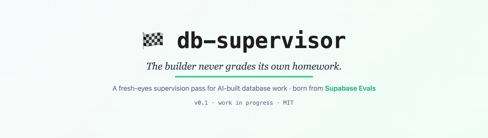
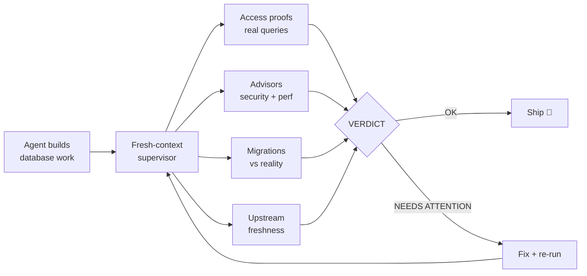

<p align="center">
  
</p>

<p align="center">
  
  
  
</p>

# supabase-db-supervisor

An agent skill that adds a **fresh-eyes supervision pass** to any database work an AI agent builds. A separate agent plays the investigator, proves who can see which data with real queries, and gives an explicit OK before anything ships. The builder never grades its own homework.

> **Status: work in progress.** This is v0.1, a starting point published in the open. The checklist, routing logic, and output format will evolve. Issues and PRs welcome.

## Why

[Supabase Evals](https://supabase.com/evals) (open sourced July 2026) measured how well coding agents build real Supabase backends across four stages. The headline:

| Stage | What it means | Top agents |
|---|---|---|
| Build | Create schema, auth, RLS from scratch | ~100% |
| Deploy | Ship it live with secrets and monitoring | ~100% |
| Investigate | Something broke, find out why | **67% for most** |
| Resolve | Fix it without breaking more | ~100% |

Agents are excellent at the part where you feel productive, and weakest at the part where you feel lost. This skill moves the Investigate stage inside the build loop, so the gap gets covered before anything ships instead of at 11pm when it breaks.

## How it works



Three principles:

1. **Fresh eyes.** The supervisor is a separate agent that never sees the builder's reasoning, only the live project.
2. **Live data, not training data.** It consults current Supabase docs and the live Evals leaderboard at run time. A model's knowledge has a date; the ecosystem doesn't.
3. **Receipts.** Every verdict ships its evidence (queries + output, docs consulted, advisor findings) so a human can validate. A verdict without receipts is an opinion.

## The report

```
DB SUPERVISOR · my-project · 2026-08-04
Built: orders table + RLS + edge function

| Area       | Item              | Status | Evidence                  |
|------------|-------------------|--------|---------------------------|
| Access     | rls: profiles     | OK     | cross-user read blocked   |
| Access     | rls: orders       | FAIL   | anon can SELECT (3 rows)  |
| Advisors   | performance       | WARN   | orders.user_id unindexed  |
| Migrations | history vs schema | OK     | 14/14 match               |
| Freshness  | agent-skills      | WARN   | upstream moved 3 days ago |

VERDICT: NEEDS ATTENTION (1 fail, 2 warn)
```

Every FAIL comes with the proof query, a suggested fix, and one sentence in plain language. No verdict, no ship.

## Bonus: route by the live leaderboard

If you pay for more than one agent subscription, the skill checks who currently leads the leaderboard on Investigate and hands the supervision to that agent, invoked from inside your main session. Nothing to open, nothing to switch. Route by stage, not by loyalty. Details in [SKILL.md](SKILL.md).

## Install

Download or clone this repo, then copy the skill into your Claude Code skills directory:

```
mkdir -p ~/.claude/skills/db-supervisor
cp SKILL.md ~/.claude/skills/db-supervisor/SKILL.md
```

Works best with the [Supabase MCP server](https://supabase.com/docs/guides/getting-started/mcp) connected, so the supervisor can run real queries, advisors, and migration checks. Pairs well with the official [Supabase agent skills](https://github.com/supabase/agent-skills).

## Roadmap

- [x] Storage and Realtime verification recipes ([#1](https://github.com/CarolMonroe22/supabase-db-supervisor/issues/1))
- [ ] Eval suite for the skill itself, waiting on real-world usage data ([#2](https://github.com/CarolMonroe22/supabase-db-supervisor/issues/2))
- [ ] CI integration: supervision on every PR that touches `supabase/` ([#3](https://github.com/CarolMonroe22/supabase-db-supervisor/issues/3))

## Credits

Benchmark data and stage definitions from [supabase/evals](https://github.com/supabase/evals) (Apache-2.0). The full story behind this skill: [Which agent is best at managing your Supabase?](https://carolmonroe.com/blog/claude-codex-or-kimi)

## License

MIT
